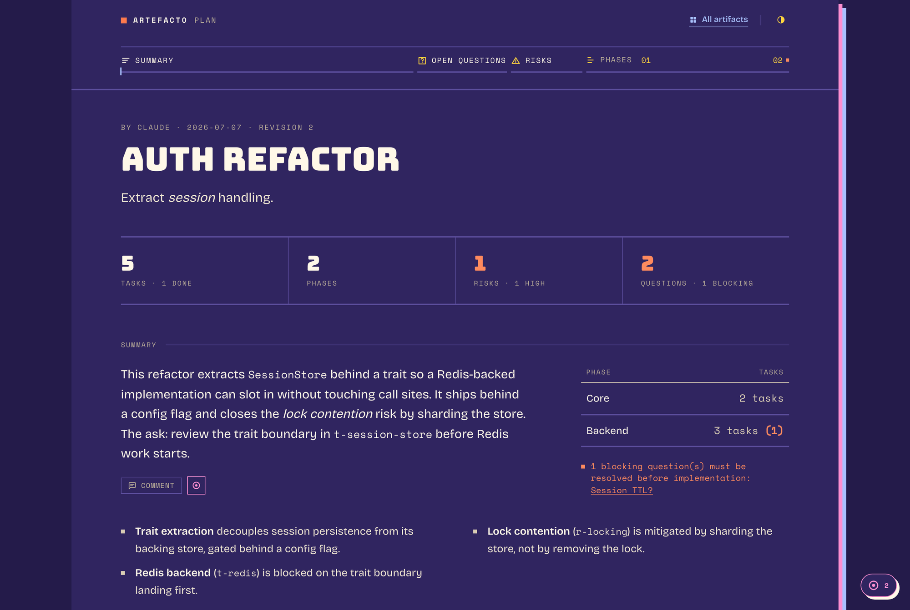

# artefacto

Interactive artifacts between you and your coding agent.



An agent emits structured data. artefacto renders it as an interactive page in
your browser. You comment, answer questions, tick steps, and give a verdict.
Every interaction flows back to the agent as data, live, while the review is
still open. The first artifact kind is a development plan. Specs, change
recaps, checklists, and findings triage are planned to follow on the same
spine.

artefacto is agent-agnostic. It ships as a single binary with a CLI that any
coding agent can drive, and a skill that teaches the loop. Installing it
teaches the agents you already have.

## Install

```sh
curl --proto '=https' --tlsv1.2 -LsSf https://github.com/elleryfamilia/artefacto/releases/latest/download/artefacto-installer.sh | sh
```

macOS and Linux, on Apple Silicon and x86-64. The binary lands in your Cargo
home, so it is on your `PATH` if `~/.cargo/bin` is.

From source instead:

```sh
cargo install --path .
```

## Use it

Installing the binary is the whole setup. The first plan you push puts the
skill that teaches the loop in front of every agent on this machine that
reads skills — Claude Code, Codex, Cursor, Gemini, opencode — and keeps it
in step with the binary on every upgrade after that. To do it now, or to
pick:

```sh
artefacto skill --for all        # every agent found here
artefacto skill --for claude     # or name them
```

It writes only where an agent already keeps its configuration, never through
a symlink, and never over a copy you have edited: it leaves a receipt of what
it wrote and only replaces its own work. `ARTEFACTO_NO_SKILL_INSTALL=1` stops
the automatic install on push; `skill --for` is an explicit request and still
does what you ask.

Then the agent writes a plan as `artefacto.plan/1` JSON and pushes it:

```sh
artefacto plan push plan.json
```

That validates the plan, starts a loopback server if one is not already
running, and opens the page in your browser. You read it, comment on any part
of it, answer its open questions, ask the agent something in the conversation
beside it, and send a verdict. The agent waits on the other side:

```sh
artefacto events --follow --agent claude
```

Each frame is one thing to act on. The agent answers with `artefacto reply`,
closes a comment with `artefacto resolve`, pushes a new revision with
`artefacto plan push`, and acknowledges what it has handled with
`artefacto ack`. Nothing is lost if either side goes away: the whole review is
an append-only log, and both the page and the agent rebuild from it.

There is no network. The server listens on loopback, the page is one
self-contained HTML file with its fonts embedded, and nothing is fetched from
anywhere.

Without a server at all:

```sh
artefacto plan render plan.json --out plan.html
```

That writes the same page as a static file. Comments are kept in the browser
and copied back to the agent by hand.

## Status

Working, and used to build itself. `plan check`, `render` and `status` produce
a static page; `plan push` with the loopback server gives the live review, the
conversation, the artifact index, and the agent's side of the loop. Not yet
built: delivering comments to the agent as they are written rather than with
the verdict, and structured options on a question.

The design spec is in `docs/specs/`, the implementation plans are in
`docs/plans/`, and `docs/BUILD-STATUS.md` records what was built, what the
reviews found, and where the code diverges from the spec.

## License

MIT. See [LICENSE](LICENSE).
